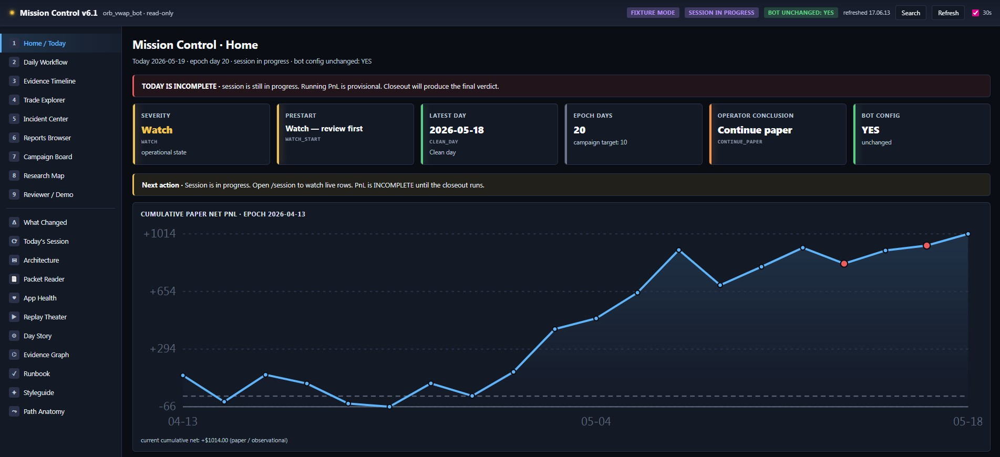
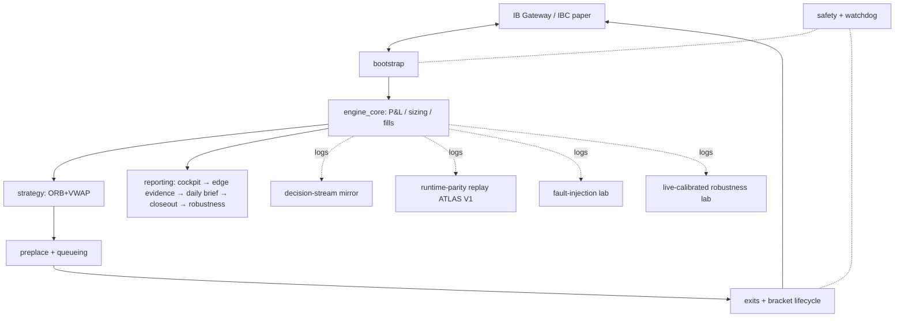
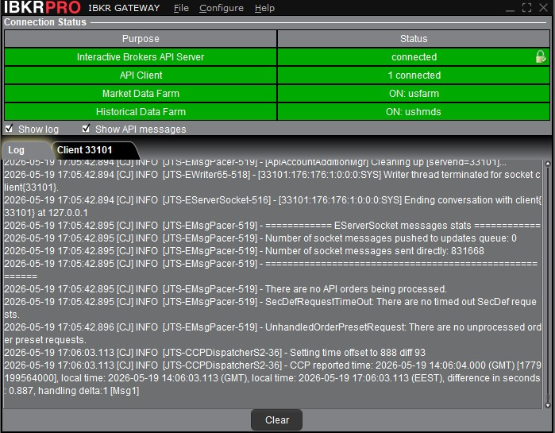
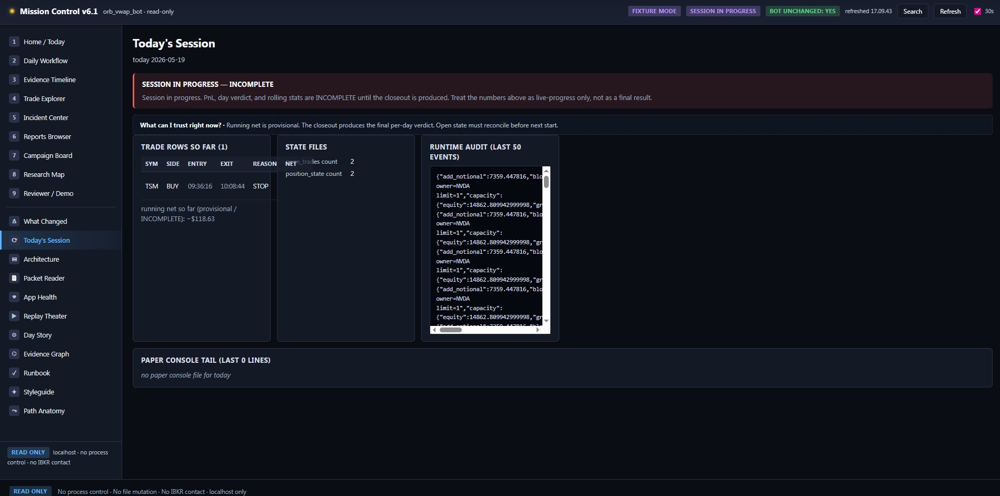

# operator-of-ai

A paper-mode algorithmic trading research and execution platform running at
Interactive Brokers, the multi-agent AI-development pattern that built and
maintains it, and worked engineering case studies from real production
failure modes.

> Co-written with Claude (Anthropic Opus 4.7) using the operator/builder/reviewer
> pattern this repo describes. Decisions about what to build, what to kill, and
> what to claim are mine. Code typing, test scaffolding, and prose drafting are
> AI-executed under my review.

---

## Start here

- **[HOW_IT_STARTED](docs/HOW_IT_STARTED.md)** — September 2025 → now, in a page
- **[METHODOLOGY](docs/METHODOLOGY.md)** — the five rules that govern development
- **Case studies** — real production engineering:
  [Watchdog Race](docs/case_studies/01_watchdog_race.md) ·
  [OCA Cancel Race](docs/case_studies/02_oca_cancel_race.md) ·
  [Daily-Stop Dead](docs/case_studies/03_daily_stop_dead.md)
- **[PROJECT_BRIEF](docs/PROJECT_BRIEF.md)** — technical overview for outside reviewers
- **[ENGINEERING_CHALLENGES](docs/ENGINEERING_CHALLENGES.md)** — catalog of hard problems
- **[INCIDENT_TAXONOMY](docs/INCIDENT_TAXONOMY.md)** — closed-enum classification system
- **[STACK](docs/STACK.md)** — what's actually used
- **5-minute version:** read the [daily-stop case study](docs/case_studies/03_daily_stop_dead.md) and skim the [project brief](docs/PROJECT_BRIEF.md). That's most of the signal.

---

## TL;DR

- **The strategy is experimental. The platform itself is the primary engineering work.**
- 19. Project started September 2025. Live at IBKR paper since Feb 2, 2026. Current epoch (Apr 13 – May 18, 2026): 20 trading days, 83 trades, +$1,055 net, PF 1.704, WR 75.9%, per-day bootstrap p(net≤0) = 4.39%. 1,228 tests across the platform, 200+ on production runtime paths. ~79k LOC Python: ~11k production runtime + execution systems, ~62k research/calibration/reporting tooling, ~6k replay frameworks (ATLAS V0/V1).
- Paper-mode at IBKR. Earlier 16-day headline numbers (84 trades, PF 1.64, +$1,028) reproduced from logs by an outside reviewer (Codex, May 10 2026). Current 20-day headline has not yet been independently re-reviewed.
- Multi-agent pattern (operator + builder + reviewer) governs development. Five written rules came from five specific mistakes — documented in [methodology](docs/METHODOLOGY.md).
- Looking for small gigs, contracts, jobs, or any work where this kind of engineering is useful. Specific examples in *What I'm available for* below.

---

## Architecture

*Solid arrows: synchronous data/control flow. Dotted arrows: asynchronous coupling, log streams, or safety hooks.*

---

## Live numbers

Current epoch (April 13 — May 18, 2026): **20 trading days, 83 trades, +$1,055 net, PF 1.704, WR 75.9%, per-day bootstrap p(net≤0) = 4.39%.** Headline statistical significance crossed below 5% on May 18; the adversarial robustness verdict still binds at **PROMISING_BUT_FRAGILE** because of Wednesday concentration, sample size, and weekday clustering. Real-money readiness gate stays **NOT_CLEARED**.

Earlier 16-day headline numbers (84 trades, PF 1.64, +$1,028) were independently reproduced from logs by an outside reviewer (Codex, May 10 2026). The current 20-day headline has not yet been independently re-reviewed.

![VS Code split view during a live session: open_trades.json, runtime_audit JSONL stream, and bot terminal showing live [STALK]/[TICK]/[GROSS_CAP] events](docs/images/live_session_split_view.jpg)

---

## Methodology — three roles, five rules

| Role | Job |
|---|---|
| **Operator** (me) | Decides what gets built, killed, shipped. Sits above the agents. |
| **Builder** (Claude / Codex) | Implements bounded missions, writes tests, produces review packets. |
| **Reviewer** (separate agent context) | Critiques builder output. Findings first. Catches overclaims. |

| Rule | Came from | What it does |
|---|---|---|
| Kill criteria | The V11→V29 calibration sweep that hit z=1.03, p=30% — variant after variant added replay PnL while overall significance stayed at noise level | Multi-cycle research declares its kill criterion in a locked spec before cycle one. When it fires, the program closes. |
| Hash-locked predeclared protocols | Loosening a threshold mid-run to flatter the numbers | Rule files get SHA-256 hashed, hash embedded in a test, audit halts if file moves. |
| Multi-model cross-checking | Trusting one model on a call it got wrong | Claude / Codex / GPT have different default failures. Cross-checking catches what single-model use misses. |
| Vocabulary discipline | Caught my own writing inflating evidence | Banned words (*proven*, *validated by backtest*, *ready for real money*). Outputs stamped NOT_ADMISSIBLE_YET. |
| Builder / reviewer / operator separation | Single-agent workflows shipping sloppy work | Three roles, three contexts, packet handoff. |

Full rulebook: [docs/METHODOLOGY.md](docs/METHODOLOGY.md).

---

## Worked engineering case studies

These document real production work — bugs found, race conditions diagnosed, fixes shipped and verified. Not demos.

1. **[The Watchdog Race & Reconnect Coordination](docs/case_studies/01_watchdog_race.md)** —
   A race between three independent timing sources was triggering false
   emergency-flatten events after every overnight reconnect. Fix: anchor
   freshness against the most recent of `(last_bar, last_reconnect,
   session_open)`, plus a coordination flag with the disconnect handler.

2. **[OCA Sibling Cancel Race & Async Resolution](docs/case_studies/02_oca_cancel_race.md)** —
   When a bracket order's stop leg fires, the broker tries to cancel the
   sibling limit, but late events keep arriving and the cancel can race the
   sibling's own fill. Handled with an async review function that waits, reads
   broker-truth, and picks one of four resolution paths.

3. **[The Dead Daily-Stop](docs/case_studies/03_daily_stop_dead.md)** —
   A `daily_stop_usd: 400` config doing literally nothing in live mode for an
   unknown window. Two unrelated-looking lines combined to render the safety
   control dead. Discovered through an audit pass; verified fixed by external
   review.

Engineering challenges that haven't been written up as full case studies but are documented in [docs/ENGINEERING_CHALLENGES.md](docs/ENGINEERING_CHALLENGES.md): negative/zero-price fill recovery with 3-stage fallback, synthetic-fill status fallback for missing broker callbacks, owner-replacement 8-branch decision tree, multi-source VWAP slope with graceful fallback, trade-identity persistence across re-runs.

---

## What I'm not claiming

- Strategy is a one-shot GPT generation early in the project, modified along the way. 25 symbols chosen before I knew how to connect to a broker. Neither impressive on its own.
- Edge is not yet established. 20 days is small. Current p-value (4.39%) is below the conventional 5% threshold, but the robustness verdict binds at PROMISING_BUT_FRAGILE.
- No real-money trade has been placed. Real-money readiness gate is NOT_CLEARED and structurally locked. Loss aversion + Kelly criterion + small capital base all say *don't deploy real money against borderline edge*. Realistic annual return on $15k base is $3,000-$8,000 — research artifact, not income.
- Replay framework stamped NOT_ADMISSIBLE_YET. Mirror reproduces ~68% of live trades within 300s tolerance — currently below the 70-80% watch band, documented as soft-drift. A runtime bar-aggregation defect is documented and deliberately not fixed because fixing would invalidate the live track record.

---

## What I'm available for

Small gigs, contracts, jobs, partnerships, or any work where the kind of engineering documented here is useful.

**Available now through summer 2026 for short and long engagement.** International business at Aalto starts September 2026; open to remote contract and part-time work during studies, including summer breaks and academic-schedule-compatible work.

**Short or one-off work** (especially welcome as a first project):
- Broker integration debugging (IBKR, ib_insync, related)
- Multi-agent AI workflow setup for a specific task
- Audit logging / closed-enum incident taxonomy for someone else's system
- Code review on async / race-condition / state-coordination code
- Architecture review of an existing trading or AI-coordinated platform
- One-off tool or component build

**Larger shapes:**
- Building or maintaining algorithmic trading infrastructure for firms with capital to deploy
- AI-assisted engineering on reliability-sensitive systems
- Junior infrastructure, platform, or systems engineering roles at fintechs, AI labs, or AI-product teams
- Contract work in any of the above

If something resonates — even a single afternoon's debugging session — reach out.

---

## About

Luka, 19. Born in Canada, raised in Finland. Bilingual English/Finnish. Completed 8.5 months of Finnish military service in March 2026. International business at Aalto University starts September 2026. Hobbies: weights, fishing, philosophy reading (mostly Nietzsche), pranks.

First line of code: September 20, 2025. The full story is in [docs/HOW_IT_STARTED.md](docs/HOW_IT_STARTED.md).

## Contact

- Email: **lukawanne@gmail.com**
- LinkedIn: **[linkedin.com/in/luka-wanne-300203237](https://www.linkedin.com/in/luka-wanne-300203237)**
- GitHub Discussions on this repo for public technical questions
