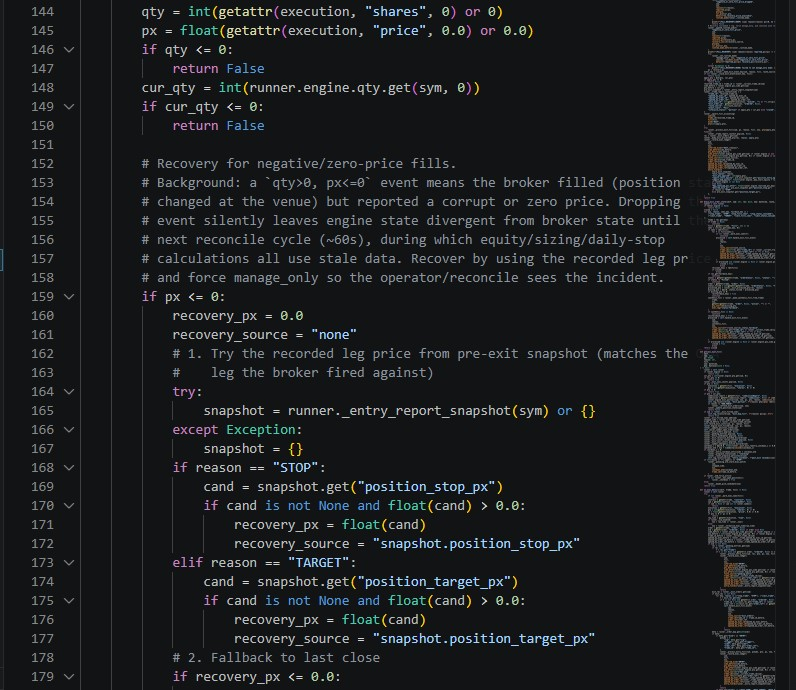
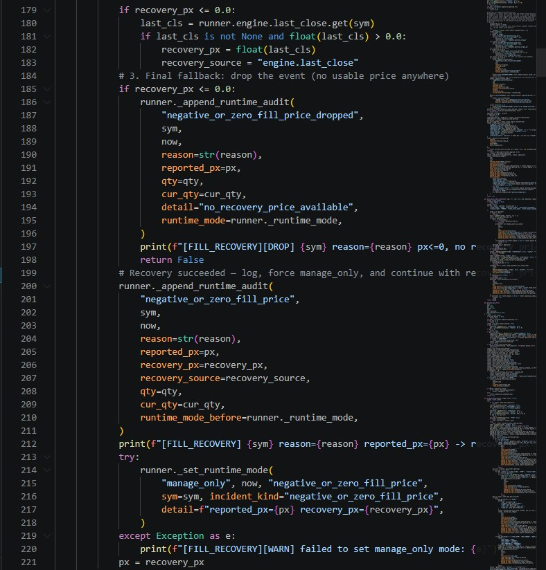
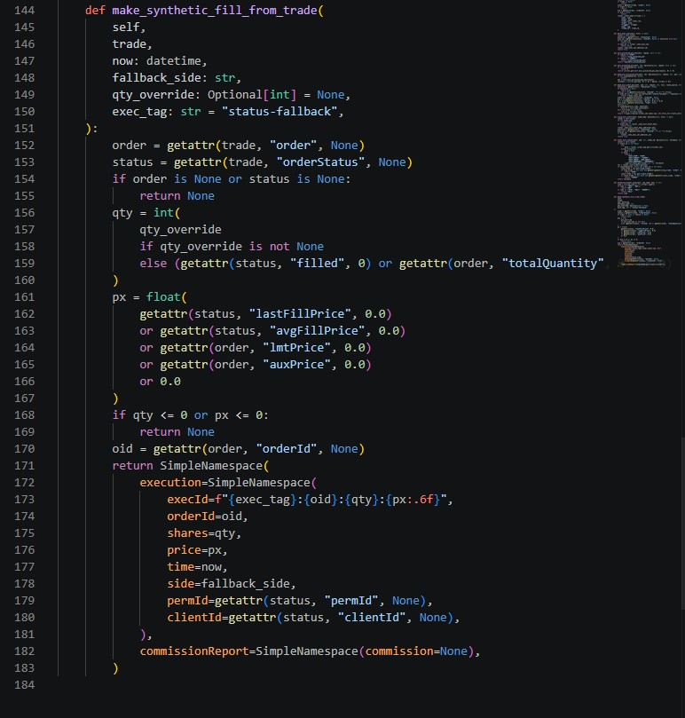
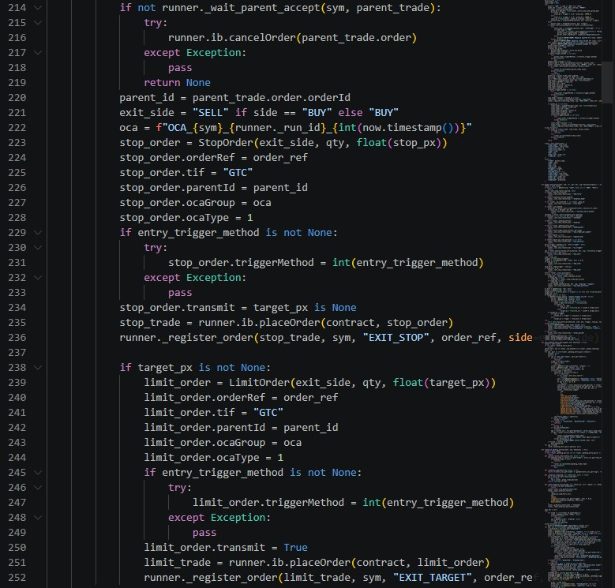
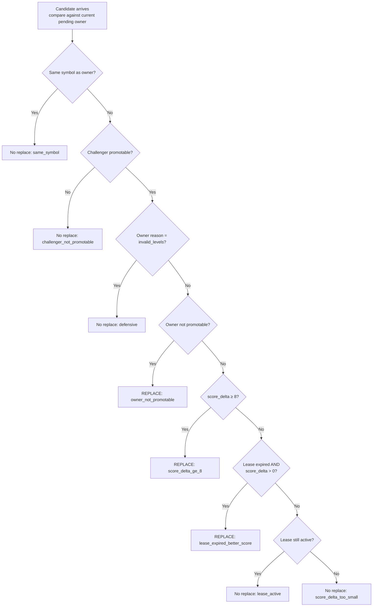

# Engineering Challenges

Catalog of hard problems handled or being handled. Linked case studies for the ones with full writeups; one-liners for the rest.

## Async + races

| Challenge | Status | What was done |
|---|---|---|
| Watchdog vs reconnect timing race after overnight reconnects | Fixed | Multi-anchor freshness + coordination flag → [case study](case_studies/01_watchdog_race.md) |
| OCA sibling cancel race with late execDetails / ack ordering | Fixed | Async review with 4 closed-enum resolution paths → [case study](case_studies/02_oca_cancel_race.md) |
| Reconcile loop racing exit-cancel review | Fixed | `_exit_reconcile_blocked` set checked every reconcile pass |

## Broker-state divergence

| Challenge | Status | What was done |
|---|---|---|
| Negative/zero-price fill events silently corrupting position state | Fixed | 3-stage recovery (snapshot leg → engine.last_close → drop), forces `manage_only` |
| Broker reports Filled status with no follow-up execDetails | Fixed | `make_synthetic_fill_from_trade` with deterministic IDs (`exec_tag="status-fallback"`) |
| Stale broker orders from prior runs | Fixed | Startup scan of openTrades, cancels orders not matching current run's orderRef |
| Unexpected broker positions at startup | Fixed | Configurable `_startup_block_unexpected_positions` raises `RuntimeError` |
| Broker bust / correction notices on filled trades | Fixed | Token-matching in errorString → `broker_adjustment_notice` audit |

### Negative/zero-price fill recovery — code

The three-stage recovery in `runtime_core/exits.py`. When the broker reports `qty>0, px<=0` (corrupt or zero price), drop-the-event would leave engine state diverged from broker state until the next reconcile (~60s) with stale equity/sizing/daily-stop math. Instead, three named fallbacks:

### Synthetic fill fabrication — code

For the "broker says Filled but no execDetails callback arrives" case. Constructs a deterministic synthetic fill with `exec_tag="status-fallback"` so it doesn't dedupe-collide with real exec IDs:

## Reliability + recovery

| Challenge | Status | What was done |
|---|---|---|
| No disconnect handler → 15s blind window before watchdog force-flatten | Fixed | Policy-classified bounded reconnect (3 schedules), `reconnect_reconcile` on success → see [Watchdog Race case study](case_studies/01_watchdog_race.md) |
| Daily-stop config silently inert in live | Fixed | Explicit `check_live_daily_stop` from reconcile loop → [case study](case_studies/03_daily_stop_dead.md) |
| Entry rejected with broker error 202 (no security definition) gap | Fixed | `retry_entry_after_gap` async loop, polls market data 120s, rebuilds bracket |
| EOD hardcoded at 15:59 fails on half-day NYSE sessions | Documented, not fixed | Listed in incident taxonomy; operator handles half-days manually |
| Bot restart mid-trade losing trade identity | Fixed | Trade ID persisted via execId / orderId / orderRef across re-runs |

## Data + signals

| Challenge | Status | What was done |
|---|---|---|
| Runtime "1m bars" are actually last-5s-thinned per a defect | Documented, deliberately not fixed | Fixing would invalidate the live track record; mirror's `last_5s_per_minute` mode matches the runtime behavior |
| Databento vs IBKR 5s prints diverge at minute boundaries | Fixed | Mirror updated to IBKR-only as primary tape; Databento kept for gap-fill |
| Multi-source VWAP slope with incomplete history | Fixed | Fallback hierarchy (1m → 5s, proportional lookback) with graceful degradation |
| Multi-iteration mirror development with residual attribution | Closed-enum framework | Each iteration (0 → 4.5b) has ANALYSIS.md with verdict + gate for next |

## Decision logic

| Challenge | Status | What was done |
|---|---|---|
| Cross-symbol arbitration when better candidate appears mid-preplace | Implemented | 8-branch owner-replacement decision tree, 45s lease, first-match-wins |
| Score formula across diverse symbol regimes | Tuned | 7-term formula, capped target_edge (0-20 bps), age decay, repeat-penalty (binary -6) |
| Cooldown leaking between preplace and signal lanes | Surfaced | `_entry_cooldown_until` shared between lanes; explicit in queueing.py audit |

### OCA bracket placement — code

Parent entry order + stop OCA + limit OCA, all linked via parent_id and OCA group, with transmit=False/True coordination so all legs land at the broker atomically:

### Owner-replacement 8-branch decision tree

## Operator + process

| Challenge | Status | What was done |
|---|---|---|
| Per-trade rule-based calibration found to be curve-fitting (V11→V29, z=1.03, p=30%) | Paradigm changed | Stopped per-trade tuning; pivoted to probabilistic + shadow-mode approach (deferred) |
| Replay PnL claims for current-bot decisions disqualified | Locked | Archived replays tagged UNTRUSTWORTHY; ATLAS V1 stamped NOT_ADMISSIBLE_YET |
| ATLAS V1.6.x hitting parity ceiling | Closed via kill criterion | 4 cycles, pair-match 0/29, criterion fired, program closed |
| External reviewer access (Codex) lapsed | Acknowledged | Paused for budget; first contract revenue restores |

## Forward work (named, not yet addressed)

Staleness detection · partial-outage detection · sub-millisecond OCA cancel races · catalyst filter for strategy · daily universe rotation · rvol gating · production chassis refactor (strategy interface decoupled from execution machinery)
