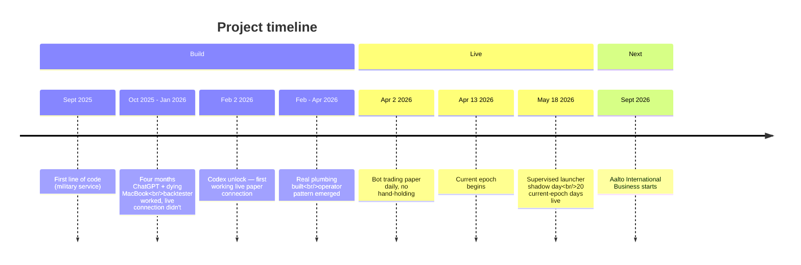

# How this started

September 20, 2025. Two and a half months into Finnish military service. Swing-trading on a discount broker in the spare hours, AI helping me read charts I half-understood, occasional small wins.

One evening: why not build something that does this? It would probably do better than me anyway. A few weeks of work, I figured.

I had never written a line of code.

## Four months of crash-hell

First version: a script GPT wrote in one prompt that I copy-pasted and watched fail.

I worked on the early plumbing using a dying MacBook that crashed ChatGPT every prompt. Sometimes the answer arrived 15 minutes later in a frozen window. Sometimes the page died and I retyped and lost another half-hour. Ten-hour coding days on top of military duties.

ChatGPT in 2025 chat-mode wasn't a good pair-programming partner for the kind of system I was building. Code that looked right and didn't compile. Three contradictory fixes in the same session. APIs hallucinated with the confidence of someone who'd read the docs.

No mentor. No coding network. My girlfriend, when I asked recently how she'd describe what I do, said: *"He's working on a trading bot — an AI bot that does daily trading with the money he gives it, and he trains it to maximize the profits."* That's about as close as the people physically near me have gotten.

## The unlock

Tried Codex against ChatGPT's advice not to. One or two days later, a working live paper connection. Not the strategy — just the plumbing. The bot could talk to my broker, get tick data, respond to events. After four months of crash-hell that alone felt enormous.

## Strategy live: February 2 — April 2, 2026

Two more months of trial and error with Codex. Most of the platform's real plumbing — preplace pipeline, queueing FSM, owner-replacement logic, bracket lifecycle, audit infrastructure — was built in this window. The operator/builder/reviewer pattern emerged from watching what made agents productive versus what made them spin.

By April: bot trading paper at IBKR daily, no hand-holding. I'd been out of the military for two weeks.

## Now

Mid-May 2026: 20 current-epoch trading days live. ~79k LOC across the platform. The strategy is experimental. The platform is the primary engineering work.
