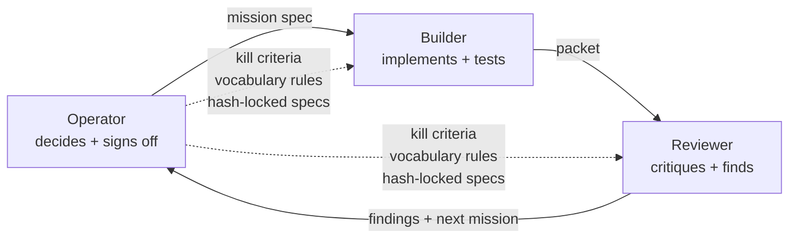

# Methodology

The development pattern that built and maintains this platform. Five rules,
each from a specific mistake.

## Three roles

- **Operator** (me) decides what gets built, killed, shipped. Sits above the agents. Reads packets, signs off changes, kills research programs when the kill criterion fires.
- **Builder** (a coding agent — currently Claude, historically Codex) implements bounded missions: writes code, runs tests, produces a review packet. Must not decide that evidence is stronger than it is.
- **Reviewer** (a second agent instance, separate role and context) critiques builder output. Findings first. Does not rewrite half the repo unless asked.

Roles communicate via packet handoff. Two agents never edit the same files at the same time. The friction of the handshake is the safety mechanism.

## The five rules

### 1. Kill criteria

**Origin:** the V11→V29 calibration sweep — roughly 30 variant tests over a couple of weeks, each fix adding $500-$1,000 to replay PnL until the bottom-line z=1.03, p=30% showed it had been curve-fitting all along. The data had been telling me to stop for days before I noticed.

**Rule:** every multi-cycle research program declares its kill criterion in the locked specification document *before* cycle one. When the criterion fires, the program closes. No fifth cycle, no pivot dressed up as continuation.

**Example:** ATLAS V1.6.a → V1.6.d. Kill criterion: if pair-match remains at 0/29 after V1.6.d, no V1.6.e. The criterion fired May 18. The program closed. Each cycle produced a useful layer-level diagnosis (state-path drift → score sparsity → coverage densification → side-determination); the criterion fired because the pair-match metric never moved, not because the work was useless. The cycle reached its terminal value rather than failing.

### 2. Hash-locked predeclared protocols

**Origin:** loosened an experimental threshold mid-run to make the numbers look better.

**Rule:** experimental rule files get SHA-256 hashed, hash embedded in a test, audit cannot proceed until the test verifies the rules haven't moved since operator approval.

**Steps:** write rules → operator signs off → hash file (canonicalized: LF line endings, no BOM) → embed in `_LOCKED_RULES_SHA256` constant → test re-hashes at runtime → audit halts on mismatch.

### 3. Multi-model cross-checking

**Origin:** trusted one model on a call it got wrong.

**Rule:** non-trivial decisions cross-check across models when budget allows. Each defaults to a different failure mode:
- **Claude** → sycophancy. Combat with explicit rules + stakes context.
- **Codex** → conservatism. Combat by asking for direct recommendations, not options.
- **GPT chat-mode** → confident hallucination. Combat by verifying API signatures against source.

**Example:** Claude (advisor mode) once recommended a particular prop firm. Codex, separately, said *"no, that's a scam, here's why, here's what to do instead."* Single-model use would have missed it.

When budget doesn't allow a second model (current state), operator scrutiny tightens to compensate.

### 4. Vocabulary discipline

**Origin:** caught my own writing inflating what evidence supported.

**Rule:** banned words. *proven*, *validated by backtest*, *edge proven*, *production-ready*, *ready for real money*, *guaranteed*, *bulletproof* do not appear in project documents. Replay outputs stamped `NOT_ADMISSIBLE_YET` even when numbers are favorable.

Allowed alternatives: *paper evidence improved*, *operational confidence improved*, *parity signal*, *not admissible yet*, *watch-only*, *promising but unproven*.

Words shape what you can claim.

### 5. Builder / reviewer / operator separation

**Origin:** single-agent workflows shipped sloppy work. Coding agents that implement their own review miss what they just wrote.

**Rule:** builder implements, reviewer critiques, operator decides. Three distinct roles with three separate agent contexts.

**Cost:** operator attention. **Benefit:** catches a class of error single-agent flows can't.

## Hard rules (binding)

- Live truth beats replay
- Epoch separation enforced in code (transition periods never blended into current-epoch headlines)
- Live runtime / config / strategy off-limits without explicit authorization
- No real-money / sizing / prop-firm advice in tooling output
- Memory hygiene: cross-session memory entries include `Why:` and `How to apply:` lines

## Why this exists

The methodology isn't theoretical. Caught:
- A prop-firm scam Claude was about to recommend (multi-model)
- A research direction that should have died sooner (kill criterion)
- A threshold I was about to loosen mid-run (hash-lock)
- Many borderline reports that vocabulary discipline forced into appropriate hedging
- Single-agent sloppy ships that builder/reviewer separation prevents
