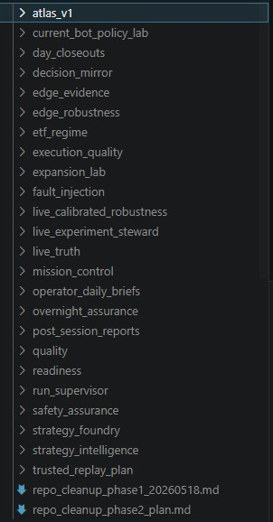
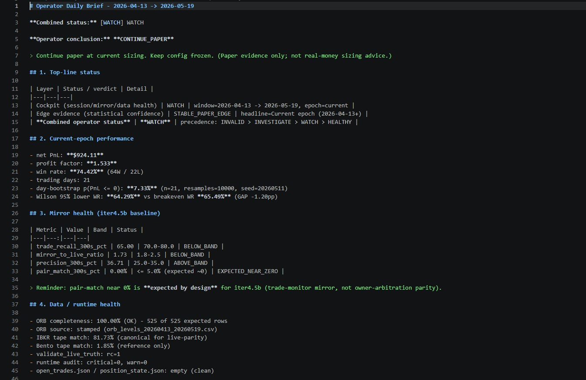
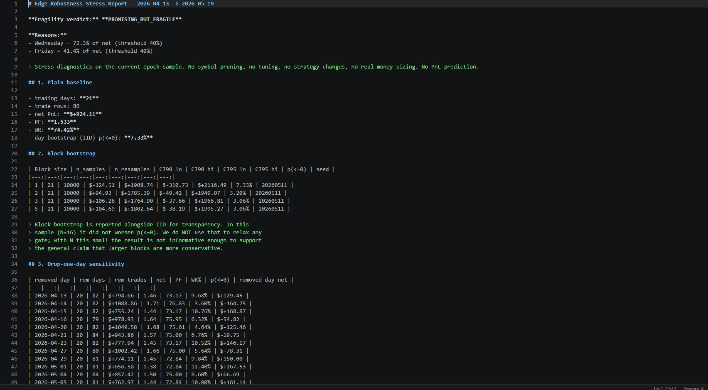
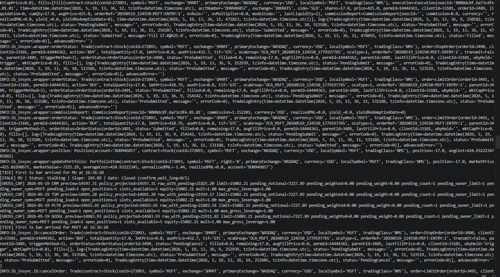
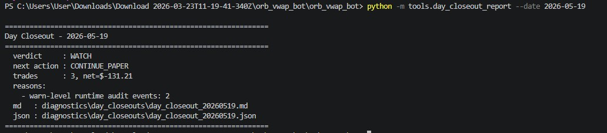
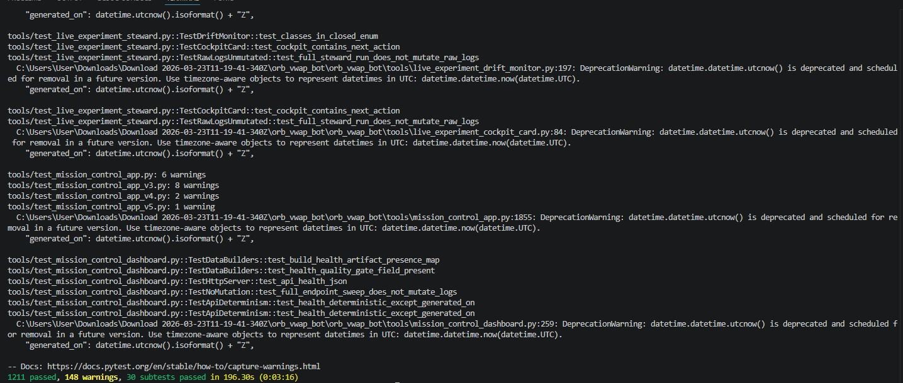

# orb_vwap_bot — Project Brief for Outside Reviewers

**Read time:** ~20 minutes.
**Audience:** quant developer, systematic trading engineer, internship interviewer, or any outside reviewer with no prior context.
**Posture:** the bot trades paper. The brief describes what is built, what is proven, what is not proven, and the discipline used to keep the two clearly separated. It does not promote real-money trading; it does not predict PnL; it does not claim a profitable bot.

---

## 1. What the project is

A US equities intraday paper-trading platform built around an Opening Range Breakout (ORB) signal confirmed by VWAP and EMA9 alignment, executed through Interactive Brokers' paper-account API (`ib_insync` + IB Gateway), with a layered operational tooling stack on top:

- safety-extension code in the live runtime
- a calibrated decision-stream mirror that scores how well a strategy-only model would have shadowed the runtime's actual behaviour
- a multi-tier reporting stack: post-session cockpit, edge evidence, operator daily brief, day closeout
- a paper-only supervisor (start/check/stop) with audit logging
- a fault-injection lab for offline safety testing
- an edge-robustness report for adversarial sample analysis
- a real-money readiness gate document (currently NOT CLEARED)

The project is intentionally over-instrumented relative to the strategy. That is the design — the platform must be ahead of the edge so the operator cannot fool themselves about what the data actually shows.



## 2. What the bot trades

- 25-symbol large-cap universe (AMD, NVDA, AAPL, MSFT, META, AMZN, GOOGL, NFLX, PLTR, UBER, TSLA, AVGO, QCOM, INTC, MU, ORCL, CRM, ADBE, TSM, ASML, JPM, BAC, XOM, CVX, COST). The universe is fixed and was not curated for ORB suitability; this is a known limitation flagged in the project memory.
- 5-minute opening range, 1-minute confirmation bars, VWAP + EMA9 alignment.
- Stop-limit entries placed via a "preplace" pipeline rather than market-on-signal. Brackets are stop + limit in OCA, actively reconciled against broker state.
- Risk: ~100 bps of equity per position, max 7 open positions, max 2 trades per symbol per day, gross leverage 1.0x, base equity override $15k, daily stop $400.
- Live mode is **not** exposed in any operator script; `--mode paper` is hard-coded in the supervised launcher and IBC's `TradingMode=paper` is the IBC config.

## 3. Current epoch and why epoch separation matters

The active configuration was finalised on **2026-04-13**. Days before that (specifically 2026-04-06 to 2026-04-10) used a slightly older configuration and are treated as a **transition** period. The reporting stack is epoch-aware:

- the headline performance number is always the **current epoch only** (2026-04-13+);
- transition data is shown alongside as a separate "reference only" block, never blended into headline statistics;
- the rule is encoded in `tools.post_session_report._epoch_split_trade_stats` and inherited by every downstream report, asserted by tests.

This matters because the most common retail trading-bot self-deception is to blend pre-fix and post-fix data, get a flattering aggregate number, and call the problem solved. Hard separation prevents that.

## 4. Live/paper evidence summary (as of 2026-05-18)

**Edge status (synthesis):** STABLE_PAPER_EDGE on evidence, PROMISING_BUT_FRAGILE on robustness (binding), WATCH on combined daily brief. The robustness verdict binds the overall promotion gate regardless of p-value crossing.

| Metric | Value |
|---|---|
| current-epoch trading days | 20 |
| net PnL | +$1,055.32 |
| profit factor | 1.704 |
| win rate | 75.9% (63W / 20L) |
| day-bootstrap p(net <= 0) | **4.39%** |
| Wilson 95% lower WR | 65.69% |
| breakeven WR (current-epoch avg_win=$40.56, avg_loss=$75.00) | 64.90% |
| cushion of observed WR over Wilson 95% lower vs breakeven | **gap of +0.79pp** |

**Honest reading:** the sample is positive and the May-18 headline crossed below the conventional 5% statistical-significance threshold. The Wilson 95% lower bound on win rate sits 0.79pp ABOVE breakeven — the cushion is positive but tight. The improvement from the May-11 -0.77pp to the current +0.79pp is real movement in the right direction.



**Robustness verdict (separate adversarial report): PROMISING_BUT_FRAGILE** binds the overall verdict regardless of p-value. Wednesday alone is a heavy contributor to net; Friday adds significantly. Top symbols still account for substantial PnL share. Late-window drawdown profile remains a watch.



Earlier 16-day headline numbers (84 trades, PF 1.64, +$1,028) were independently reproduced from logs by an outside reviewer (Codex, May 10 2026). The current 20-day headline has not yet been independently re-reviewed.



## 5. Architecture overview

```
                +--------------------------+
                |   IB Gateway (paper)     |
                +--------------------------+
                              |
                       ib_insync API
                              |
          +-------------------+--------------------+
          |              runtime_core              |
          | bootstrap.py | safety.py | exits.py    |
          | preplace.py  | queueing.py| ...        |
          +-------------------+--------------------+
                              |
                      engine_core (P&L, sizing, fills)
                              |
                      strategy/strategy_orb_vwap.py
                              |
+-------------------+   logs/   +----------------------+
|  paper_console    |  + state  |  runtime_audit.jsonl |
+-------------------+           +----------------------+
                              |
            +-----------------+-----------------+
            |          REPORTING STACK          |
            |                                   |
            |  decision_stream_mirror_iter4_5   |
            |    -> post_session_report          |
            |    -> edge_evidence_report         |
            |    -> operator_daily_brief         |
            |    -> day_closeout_report          |
            |                                   |
            |  edge_robustness_report (stress)  |
            |  fault_injection_lab (safety)     |
            |  real_money_readiness_gates       |
            +-----------------------------------+
                              |
            +-----------------+-----------------+
            |       OPERATOR SCRIPTS            |
            | start_paper_supervised.ps1        |
            | check_paper_supervised.ps1        |
            | stop_paper_supervised.ps1         |
            | run_operator_daily_brief.ps1      |
            +-----------------------------------+
```

**Strategy** (`strategy/strategy_orb_vwap.py`) is pure: it decides structural validity (ORB width, VWAP/EMA alignment, confirm closes).

**Runtime** (`runtime_core/`) decides operational placeability: when to preplace, when to cancel, how to handle owner replacement, how to reconcile against broker state, how to handle disconnects, daily stops, and negative-fill recovery.

**Engine** (`engine_core/`) decides accounting: position state, fills, partials, PnL.

**Mirror** (`tools/decision_stream_mirror_iter4_5.py`) reproduces what a strategy-only model would have promoted, from the same tape, with audit-derived inputs. Calibrated to ~68% trade-recall within 300s tolerance against live truth on the canonical window — currently below the 70-80% watch band per the soft-drift metric. Owner-arbitration parity is **0% by design** (the mirror is a trade-monitor mirror, not an owner-arbitration parity mirror; this is documented).

**Reporting layers** read artifacts from logs and mirror outputs and produce verdicts at four scopes: (1) per-window cockpit, (2) statistical edge evidence, (3) unified daily brief, (4) per-day closeout. Each layer never blends transition data into the headline.

## 6. The hard lessons

The project memory contains many "I learned this the wrong way" entries. The reviewer should read these as evidence of process maturity, not weakness.

1. **Naive replay was misleading.** Per-trade rule-based calibration over many variants (`V11 -> V29`) produced spurious "improvements" that were actually curve-fits (z=1.03, p=30% under permutation).
2. **Databento vs IBKR tape parity was not free.** Live used IBKR 5s; research initially used Databento gap-filled. Same instrument, same minute, different prints. The mirror only became reliable after we established IBKR `data/5s/` as canonical for live-parity work.
3. **Live "1m bars" were actually last-5s-thinned.** A latent runtime-aggregation defect. The mirror used to look broken; once the defect was understood, the mirror's discrepancies were the right discrepancies. Deliberately not fixed because fixing would invalidate the live track record.
4. **The preplace pipeline dominates the strategy.** A pure-strategy shadow misses ~40% of live trades; the gap is the preplace + queueing + owner-replacement layer. Solved in iter4.5b via the per-symbol/per-side refresh table.
5. **Owner-arbitration parity was not solved.** Mirror produces count-similar but semantically unrelated owner-replacement decisions (0% pair match). This is the documented limitation; iter4.6+ work was deferred.
6. **The "count parity" trap.** Two streams that agree on aggregate counts can still disagree on every individual decision. Always require pair-level identity, not count-level.
7. **Capacity-model trap.** Early mirror enforced `max_open_positions=7` strictly; live's actual peak was 2. The mirror's blocked-promotions logic was inflating "would have traded" estimates. Fixed in iter4.1.

## 7. What is established

- The runtime safety extensions (daily stop, negative-fill recovery, IB disconnect handler with policy classification + reconcile + bounded reconnect) are wired and unit-tested. **53 mock-based safety tests pass.** Operational-readiness checks pass.
- The mirror reproduces ~68% of live trades within 300s tolerance on the calibrated window, with documented bands.
- The reporting stack is end-to-end auditable: every metric the operator sees can be traced to a stamped JSON or CSV in `diagnostics/`.
- Epoch separation is enforced by tests; transition data is never blended into the headline.
- The supervisor refuses to stop the bot while local position state is non-empty (unless `-ForceStop`), and uses cmdline-filtered selectors for both the bot process and IB Gateway.
- The fault-injection lab covers 34 deterministic scenarios across daily-stop, negative-fill, reconnect, and supervisor categories.
- The whole platform has **1,228** passing tests at the most recent quality gate, with 200+ in the production-code test suite specifically.

## 8. What is not yet established

- The bot's edge is not statistically robust on the current sample (20 days, p(<=0) = 4.39% just below conventional threshold, robustness verdict still binds at PROMISING_BUT_FRAGILE).
- No real-money trading has occurred. The strategy has never been exposed to real-money execution conditions.
- The mirror does not reproduce live's owner-arbitration decisions (0% pair-match, by design).
- No real IB fault-injection has been performed (no real socket drop, no real corrupted fill). The 53 safety tests use mocks.
- The 25-symbol universe is not curated for ORB suitability; the literature-recommended RVOL filter is not implemented.
- Day-of-week dominance (Wednesday and Friday carrying a heavy share of net) suggests the sample may be regime-specific rather than universal.

## 9. Safety posture

- Live mode is not exposed in any operator script.
- The `$400` daily-stop has soft (manage_only) and hard (emergency flatten) thresholds, with realized-only and MTM modes; this method bypasses an `external_exit_management` gate that previously rendered the configured value dead in live (see [Dead Daily-Stop case study](case_studies/03_daily_stop_dead.md)).
- Negative-or-zero-price fills have a three-stage recovery (snapshot position price -> last_close -> drop), with manage_only escalation on recovery.
- IB disconnect handler classifies the reconnect policy (rth_positions / rth_flat / off_hours), uses bounded backoff, reclassifies on session boundary, and either flattens + shuts down (rth_positions exhaustion) or transitions to manage_only / indefinite slow retry (see [Watchdog Race case study](case_studies/01_watchdog_race.md)).
- The supervisor's stop script refuses if local state is non-empty (unless `-ForceStop`), uses repo-path-and-`run_live.py` cmdline filtering, and gates Gateway stop behind an explicit `-StopGateway` flag.

![Bot startup banner — supervised launcher boot sequence: config load, IB connect on 127.0.0.1:4002, equity override, contract qualification for all 25 symbols, 5s hist-stream subscriptions, ending at `[STARTUP] state=ready detail=entries_enabled`](images/bot_startup_banner.jpg)

## 10. Current recommendation: continue paper

As of the May 18 closeout, the 20-day milestone has been reached.

- `edge_evidence_report` verdict: STABLE_PAPER_EDGE
- `edge_robustness_report` verdict: PROMISING_BUT_FRAGILE (binding)
- Combined `operator_daily_brief` verdict: WATCH (3 soft-drift mirror metrics outside their bands; no critical or warn-level audit events after the off-hours policy filter)
- Operator conclusion: CONTINUE_PAPER
- Verdict promotion: NOT promoted — robustness binds regardless of statistical-significance threshold crossing

## 11. How to run the main commands

```
# morning (Gateway not yet running)
.\scripts\start_paper_supervised.ps1 -StartGateway

# health check anytime
.\scripts\check_paper_supervised.ps1

# safe stop (refuses if open positions)
.\scripts\stop_paper_supervised.ps1

# end-of-session (cockpit + edge evidence + brief)
.\scripts\run_operator_daily_brief.ps1

# per-day closeout
python -m tools.day_closeout_report --date YYYY-MM-DD --skip-rerun
python -m tools.index_day_closeouts
```



```

# adversarial robustness on the current epoch
python -m tools.edge_robustness_report --start-date 2026-04-13 --end-date YYYY-MM-DD

# safety-stack tests + fault-injection lab
python -m tools.test_safety_extensions
python -m tools.operational_readiness
python -m tools.fault_injection_lab
```

## 12. Why this demonstrates engineering discipline

The interesting part of this project is not the strategy. The interesting part is the discipline imposed around the strategy:

- **Hard rules at every layer.** Each tool refuses to predict PnL, refuses to recommend real-money sizing, and is unit-tested for the refusal.
- **Mock-based safety testing for asynchronous broker behaviour.** Daily-stop variants, negative-fill recovery, IB disconnect/reconnect policy transitions are all unit-tested without a real broker.


- **Epoch isolation as a code contract.** Transition data is never blended into headline numbers; the contract is asserted by tests.
- **Bucketed verdicts.** Reasons go into `info` / `watch` / `investigate` / `invalid` buckets; only the highest-bucketed reason flips the verdict; INFO never affects the outcome.
- **A stress report whose verdict is allowed to be PROMISING_BUT_FRAGILE.** The robustness tool is built to fail honestly. It is not a reporting tool the operator can argue with.
- **A readiness gate document that says NOT_CLEARED.** Real-money discussion is structurally locked behind statistical, operational, safety, data, and human gates — not vibes.
- **A platform that says "the platform is more proven than the edge" and means it.** The right reaction to an unproven edge is to keep running paper and resist tuning. The reporting stack tells the operator that, in writing, every day.

The combination of an honest paper edge (positive but not yet proven), a calibrated runtime mirror, multi-tier reporting with epoch discipline, an offline fault-injection lab, an adversarial robustness report, and an explicit non-advisory readiness gate is the actual deliverable. The strategy is the experiment; the platform is the work.

---

_Paper-trading diagnostic only. Not financial advice. No PnL prediction. No real-money sizing recommendation._
