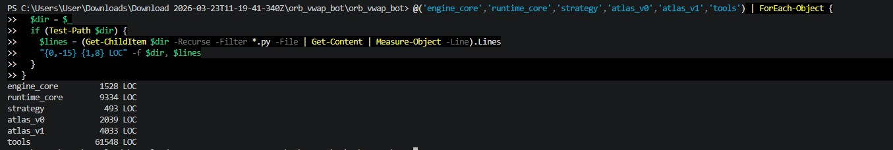
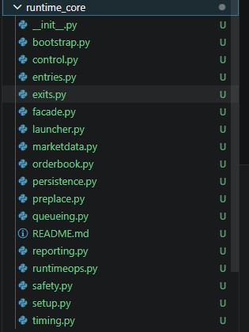
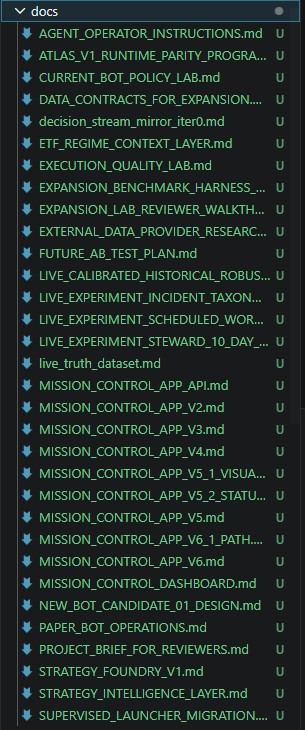

# Stack

What this project actually uses. No badges, no logo grid.

**Scale:** ~79k LOC Python across production runtime, research tooling, and replay frameworks. ~35k lines of operational/research documentation. 1,228 tests at the most recent quality gate.

## Core
- Python 3.12 · asyncio · pytest · hypothesis
- PowerShell (operator scripts, Windows host)

## Broker
- Interactive Brokers TWS / Gateway, paper mode
- ib_insync (Python wrapper)
- IBC (Interactive Brokers Controller) for auto-login
- OCA bracket orders (parent stop or stop-limit + stop OCA + limit OCA)

## Data
- CSV (5s tape, trade logs)
- JSONL (append-only audit streams, supervisor events)
- Parquet (research datasets, ATLAS V0)
- Databento (gap-fill only; deprecated as primary after live-parity research)

## Analysis
- pandas · scipy (Wilson CI, bootstrap, Page-Hinkley, conformal coverage) · numpy
- SHA-256 hash-locking for predeclared experimental rule files

## State
- Local filesystem · JSON state files · append-only JSONL logs
- Chosen over DB for deterministic recovery, audit-by-construction, simple cross-session reattach

## AI agents
- Claude (Anthropic, Opus 4.7) — primary
- Codex (OpenAI) — historical external review, currently paused for budget
- GPT — earlier-stage building (Sept 2025 – Feb 2026)
- Multi-model cross-checking pattern in [METHODOLOGY](METHODOLOGY.md)

## Observability
- Custom multi-tier reporting stack
- Mermaid for architecture diagrams
- JSONL event sourcing for forensics
- Closed-enum incident taxonomy (11 categories — [INCIDENT_TAXONOMY](INCIDENT_TAXONOMY.md))
