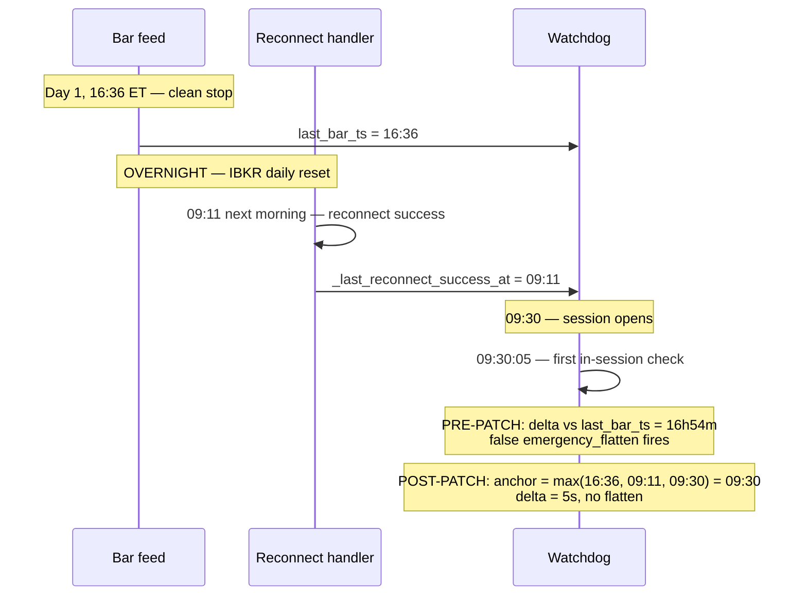
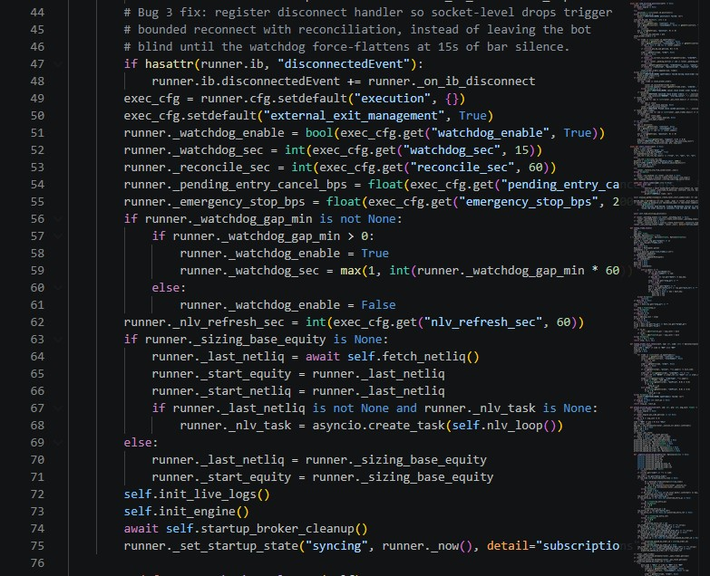
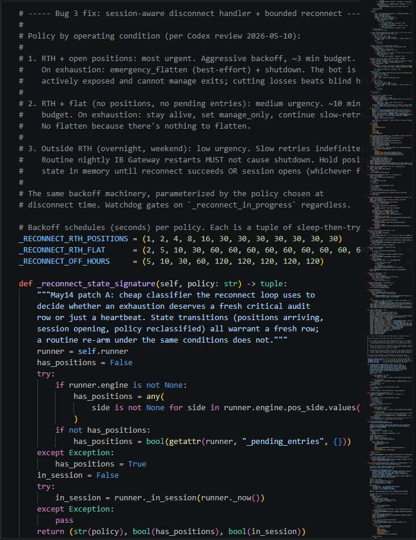
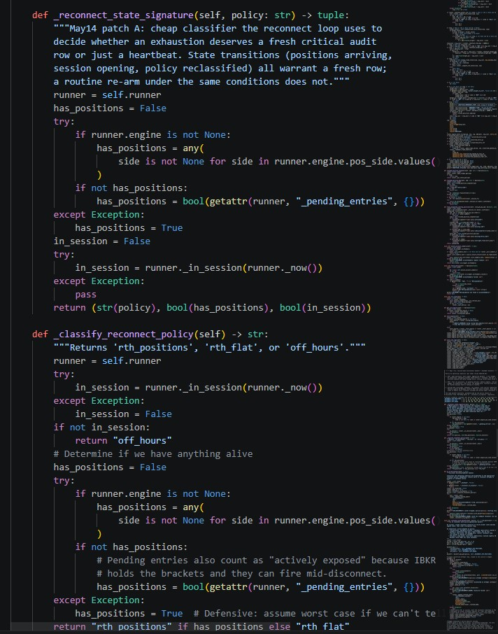
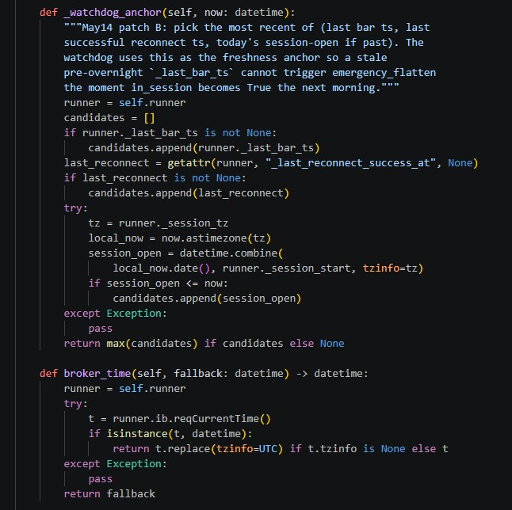

# Case Study — Watchdog Race & Reconnect Coordination

*A race between three timing sources triggered false emergency-flatten after every overnight reconnect. The fix coordinates the watchdog with the disconnect handler that already existed.*

## What the watchdog does

If bar data stops arriving for >15s during session, force-flatten everything. Bot-blind-and-holding is the failure mode worse than losing money. The action — `emergency_flatten` — cancels pending entries and market-orders all positions closed.

## Pre-patch loop

The pre-patch watchdog loop was structurally simple: one signal (`_last_bar_ts`), one comparison, one trigger. Caught real silent-data-loss in mid-session. It had neither the `_reconnect_in_progress` skip nor the multi-anchor freshness — both of which are visible in the post-patch loop below.


## Failure mode

Bot stops cleanly at end of session — say 16:36 ET. Last bar timestamp records that close. Gateway disconnects overnight per IBKR's daily reset (this is normal — IBKR forces a server-side restart each day). Bot reconnects automatically at 09:11 ET the next morning. Position state intact, contracts re-qualified, ready to trade.

Session opens 09:30. The pre-patch watchdog's first in-session check at 09:30:05 computed:

```
delta = 09:30:05 today - 16:36 yesterday = 16h54m
```

Far over 15 seconds. Emergency-flatten fired against a healthy bot before any new bar could arrive.

Same race happened on mid-session reconnects longer than 15 seconds: while the disconnect handler was doing its work, no bars were flowing, and the watchdog couldn't tell the difference between *bot is blind* and *bot is healthy, reconnect in progress*.



## Why longer timeout doesn't fix it

Relaxing the threshold trades the false-positive for a worse problem: weaker detection of real silent-data-loss. The point of a watchdog is tight detection.

The bug isn't that the trigger is too sensitive. The anchor is wrong.

## The disconnect handler that already existed

`runtime_core/bootstrap.py` has a disconnect handler that classifies by operating condition and dispatches to one of three policy-specific backoff schedules. It was already stamping `_last_reconnect_success_at` on success and `_reconnect_in_progress = True` while attempting. The watchdog just wasn't using it.



The three policies:



The classifier:



| Policy | When | Schedule | On exhaustion |
|---|---|---|---|
| `rth_positions` | In session, holding positions | `(1,2,4,8,16,30×7)` ~3m | emergency_flatten + shutdown |
| `rth_flat` | In session, no positions | `(2,5,10,30,60×9)` ~10m | manage_only, restart loop |
| `off_hours` | Outside session | `(5,10,30,60,120×5)` ~13m/cycle | indefinite slow-retry |

## The fix

Two coordinated changes.

**1. Anchor against the most recent of three signals:**



Overnight case: anchor becomes 09:30 (session_open). At 09:30:05, delta = 5s. No false flatten.

**2. Coordination flag** — watchdog skips entirely while reconnect is in flight (visible in the watchdog_loop screenshot above as the `if getattr(runner, "_reconnect_in_progress", False): continue` guard).

If the reconnect handler exhausts its budget, the *handler itself* triggers `emergency_flatten` under the `rth_positions` policy — the correct authority for that call.

## Why this shape

- **The anchor only adds signals, never removes them.** Real silent-data-loss during a normal session still triggers correctly: `_last_bar_ts` recent, `session_open` hours ago, no recent reconnect → anchor is `_last_bar_ts` → delta exceeds threshold → flatten fires. Sensitivity to real problems unchanged.
- **The coordination uses an existing flag.** No new synchronization primitives. Two independent loops, one shared flag, no locks.
- **Authority for emergency_flatten under disconnect is the disconnect handler.** The watchdog doesn't try to be smart about whether a reconnect will succeed. Avoids a class of bug where two systems both decide to flatten or both decide to wait.

## What this fix doesn't catch

The watchdog detects *silence* — no bars arriving. It doesn't detect *staleness* (bars arriving but containing repeated or wrong data) or *partial outages* (some symbols stop while others continue). Both are real problems. Both are in the working list of engineering challenges. Not in scope for this fix.

## Files

`runtime_core/runtimeops.py` (watchdog loop, `_watchdog_anchor`) · `runtime_core/bootstrap.py` (disconnect handler, reconnect policies, flags)
