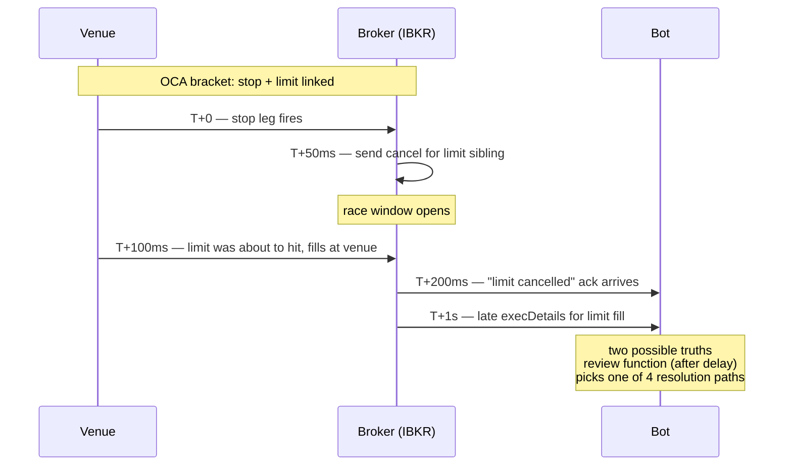
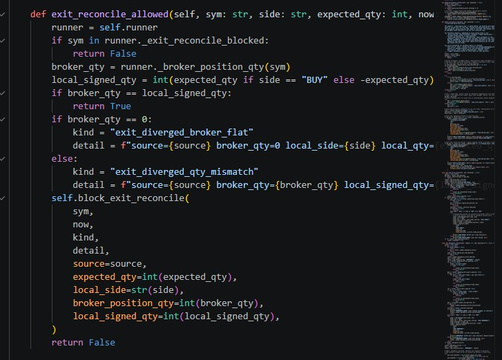

# Case Study — OCA Sibling Cancel Race & Async Resolution

*When a bracket's stop leg fires, the broker tries to cancel the sibling limit. Late events arrive for hundreds of milliseconds; the cancel can race the sibling's own fill. Handled with an async review function that picks one of four resolution paths.*

## The race



```
T+0     stop fires at venue
T+50ms  broker sends cancel for limit sibling
T+100ms limit was about to hit; fills at venue
T+200ms cancel ack arrives saying "limit cancelled"
T+1s    late execDetails arrives for the limit that "got cancelled but also filled"
```

Two possible truths after this:
1. Stop closed the position; cancel was clean
2. Stop and limit both filled before the cancel could land; position closed by both

Acting on the wrong one creates state divergence between bot and broker.

## IB's signal

Broker emits codes `202` (order being cancelled) or `10148` (cannot cancel filled order) for the sibling. These look like normal cancel notices but carry the race context. Code 202 on an exit order during an active position is the trigger to investigate, not to act.

## Four resolution paths

`safety.py:review_exit_cancel` waits a configurable delay (low seconds), then evaluates in order:

| Path | Condition | Resolution |
|---|---|---|
| `closed_after_sibling_fill` | Drain detects sibling actually filled before cancel | Position closed cleanly, no action |
| `flat_after_cancel` | Broker reports flat, no sibling fill | Stop closed it normally, cancel landed cleanly |
| `replaced_after_cancel` | Position exists, exit orders gone | Place fresh exit bracket |
| `refresh_requested_after_cancel` | Position exists, exit orders partial | Refresh existing bracket to consistent state |

Each path emits a structured audit event with `detail` = one of the four enum values, so forensic passes reconstruct exactly which path was taken.

## Broker-state divergence detection

Before doing any of the above, the system checks whether broker truth and local state actually agree. If broker is flat while local says we have a position, that's `exit_diverged_broker_flat`. If sizes mismatch, that's `exit_diverged_qty_mismatch`. Either case blocks further exit-reconcile work and escalates runtime mode to `halt` or `manage_only`:



## Why a delay

IBKR's API doesn't guarantee ordering between `orderStatus`, `execDetails`, and cancel acks within the late-event window. Acting immediately on the cancel notice misses sibling late-fills. Trading one round-trip of latency for race-free resolution is the right tradeoff for a non-HFT system.

## Coordination with reconcile

`block_exit_reconcile` adds the symbol to `_exit_reconcile_blocked` during the review. The reconcile loop checks this set every pass and skips blocked symbols — otherwise it could start placing new exit orders against an "open" position while the review concludes the position is closed. Two independent loops, one shared set, no locks.

## What this doesn't handle

- Sub-millisecond races (stop + limit within same broker microsecond) — rare at retail size, unrecoverable until evidence shows otherwise
- Missing-callback case where execDetails never arrives — handled separately by `make_synthetic_fill_from_trade` for the Filled-status path
- Pathological cancel storms during high-vol minutes — not designed for that

## Files

`runtime_core/safety.py` (`review_exit_cancel`, `block_exit_reconcile`, `exit_reconcile_allowed`) · `runtime_core/exits.py` (`drain_exit_order_state`) · `runtime_core/runtimeops.py:on_ib_error` (entry trigger)
