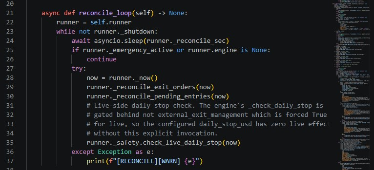

# Case Study — The Dead Daily-Stop

*A `daily_stop_usd: 400` config doing literally nothing in live mode for an unknown window. Two unrelated-looking lines combined to render the safety control dead. Discovered through an audit pass; verified fixed by external review.*

## The setup

Config in place:

```yaml
risk:
  daily_stop_usd: 400
```

Operator confidence: "I have a daily stop."
Actual behavior: zero protection.

## The discovery

A May 9 audit pass through the safety / exits / bootstrap code. Two lines, in unrelated files, combined to render the safety control inert in live mode.

`engine_core/runtime.py:113-114`:


Reads fine in isolation — there's a separate exit path for some modes.

`runtime_core/bootstrap.py:44`:

```python
exec_cfg.setdefault("external_exit_management", True)
```

Live mode forces `external_exit_management=True`. Always.

Combined: in live, the `if not external_exit_management` branch is always False. `_check_daily_stop` is never invoked. The `daily_stop_usd: 400` config silently does nothing.

This was live behavior for an unknown window before discovery. Bot ran daily. Operator saw the config and felt safe. Actual safety control inert.

## Why "dead config" is worse than "no config"

No config: operator knows there's no daily-stop, sizes accordingly, watches manually.

Dead config: operator believes there's a daily-stop, sizes accordingly, doesn't watch as carefully. The false sense of safety is the failure mode.

## The fix

Explicit live-side call from `runtime_core/runtimeops.py:reconcile_loop`:



The in-code comment documents the historical bug. Future readers (including future me) inherit the reasoning at the point of modification.

Soft vs hard thresholds in `safety.py`:
- **Soft:** `manage_only` mode. Stop placing entries. Let existing brackets close. Operator can intervene.
- **Hard:** `emergency_flatten`. Market-order close. Used only past a second multiple of the limit.

## External verification

Codex independent review on May 10. Verified the call is wired, the comment is accurate, mock-based test coverage exists in `tools/test_safety_extensions.py`.

External reviewer reading the diff is meaningfully different from self-audit. Single-developer projects rarely catch this class of bug because the developer remembers writing the gate "for a reason" and doesn't question the combined effect with other code. An outside reviewer asks "but does this actually do anything in live?" and finds the answer is no.

## On publishing this

The instinct on finding an embarrassing live-code bug is to quietly fix it. Publishing with file:line evidence of the original failure signals process discipline over reputation management. The vocabulary discipline that bans *production-ready* applies here too — pretending the platform was always safe would contradict the framework.

## Files

`engine_core/runtime.py:113-114` (original gating) · `runtime_core/bootstrap.py:44` (forced flag) · `runtime_core/safety.py:check_live_daily_stop` (the live-side check) · `runtime_core/runtimeops.py:reconcile_loop` (where it's invoked) · `tools/test_safety_extensions.py` (mock-based test)
